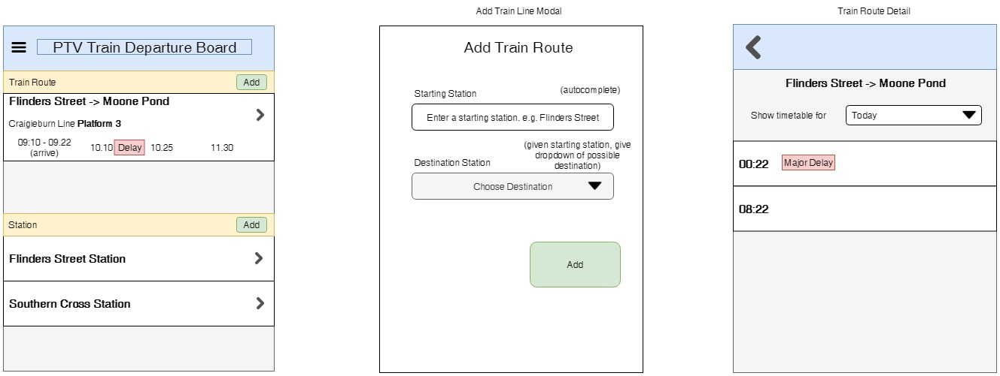

# Vic Train Board

## Project Description

This project aims to show relevant info on Melbourne Metro train without the clutter.

##### This project is a work in progress

## Architecture

The REST API for this app is load-balanced using Nginx to 3 API developed in different languages (for portfolio purpose).

## App Components

### Mobile App

The mobile app is built using React Native and is available at

https://github.com/albertsundjaja/vic_train_react_native

### Node REST API

This repo contains the code for the Node REST API built with Express and MongoDB as the data storage.

### Python PTV Updater

The periodic updater in Python is available at

https://github.com/albertsundjaja/vic_train_ptv_updater_python